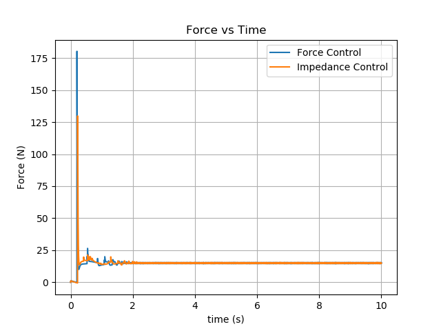
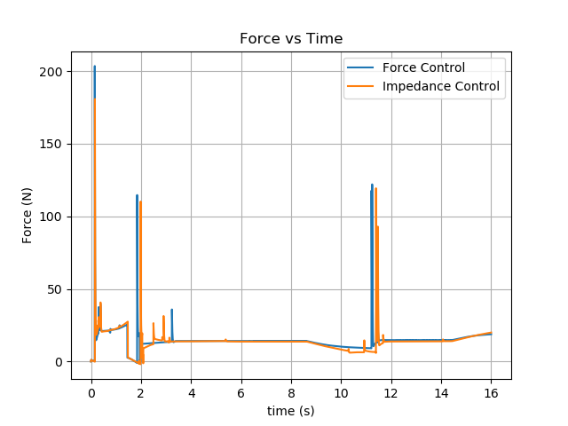
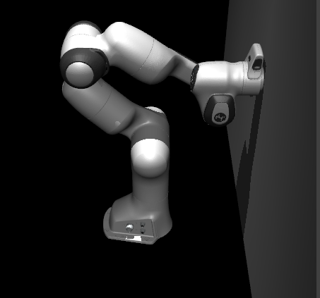
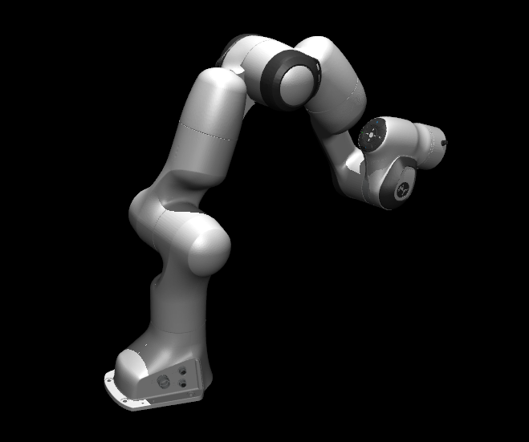

### Force Control 

Here, we have a static whiteboard obstacle.

Here, we have a whiteboard as an obstacle that is varying constantly. I implement force control such that a constant force is applied along the x-axis of the end-effector.

Difference between force and impedance controller:
- Force controller attempts to constantly apply 15N of force by projecting end effector forces to joint torques. Whereas in impedance controller, we normally attempt to reach a desired position and implicitly obtain a desired force which allows for a smoother approach to the desired force.

### Inverse Kinematics

Error 4.2489468131335357e-07 0.0002155289937854324
Computed IK angles [0.5740863127842615, 0.3115965421070712, -0.6796189555630127, -2.0787911387264293, -0.11481848580826978, 3.914113692658869, -2.8646372562972053]

Joints:
[0.0, 0.0, 0.0, 0.0, 0.0, 0.0, 0.0]
computed FK ee position
[ 8.80000000e-02 -8.93992163e-18  9.26000000e-01]
computed FK ee rotation
[[ 1.0000000e+00  0.0000000e+00  0.0000000e+00]
 [ 0.0000000e+00 -1.0000000e+00 -1.2246468e-16]
 [ 0.0000000e+00  1.2246468e-16 -1.0000000e+00]]

Joints:
[0, 0, -0.7853981633974483, -0.2617993877991494, 0.3490658503988659, 0.2617993877991494, -1.3089969389957472]
computed FK ee position
[ 0.15710277 -0.10259332  0.93602711]
computed FK ee rotation
[[ 0.64935398  0.75871099  0.05193309]
 [ 0.7552124  -0.65137389  0.07325497]
 [ 0.08940721 -0.00834789 -0.99596017]]

Joints:
[0, 0, 0.5235987755982988, -1.0471975511965976, -1.1344640137963142, 0.7853981633974483, 0.0]
computed FK ee position
[0.40136375 0.08742801 0.85526363]
computed FK ee rotation
[[ 0.98015816 -0.18113365 -0.08050201]
 [-0.17410263 -0.5925751  -0.78647507]
 [ 0.09475362  0.78488557 -0.61235316]]
